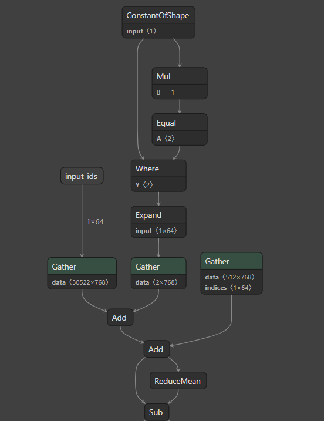
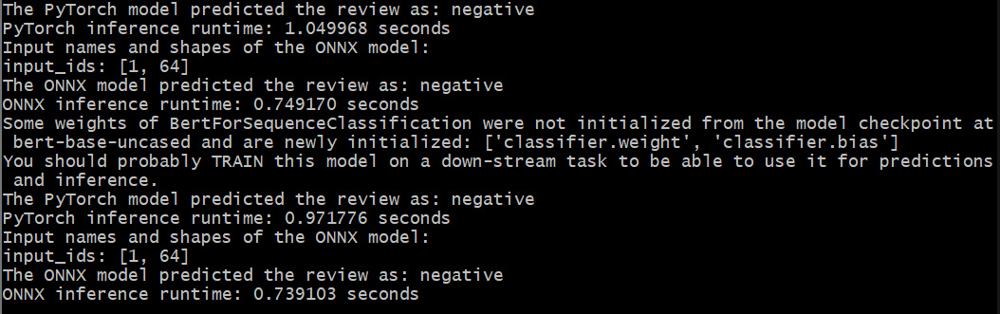

# PyTorch to ONNX Conversion Project

## Table of Contents

- [Introduction](#introduction)
- [Dataset](#dataset)
- [Requirements](#requirements)
- [Getting Started](#getting-started)
- [Usage](#usage)
- [Netron Trace](#netron-visualization-of-our-model)
- [Predictions and Inference](#pytorch-and-onnx-predictions-and-inference)
- [Contributing](#contributing)
- [License](#license)

## Introduction

This project demonstrates how to convert a PyTorch model to the ONNX format using the IMDb movie reviews dataset and the BERT model for sentiment analysis. Our objective is to demonstrate how ONNX improves runtime efficiency in self-attention based architectures (in this case we are using BERT to demonstrate this due to its relatively simple design).

## Purpose and Objectives

The goal of this project is to showcase the process of converting a PyTorch model to the ONNX format. We use the IMDb movie reviews dataset for sentiment analysis and the BERT model, which is a popular Transformer-based language model developed by Google. Our goal is to understand how ONNX provides us with valuable runtime conversion tools through the following tasks:

- [x] [Training BERT using PyTorch on the IMDb movie reviews dataset (Val: ?)](model.py)
- [x] [Converting the trained PyTorch model to the ONNX format](onnx_converter.py)
- [x] [Benchmarking performance between pytorch and ONNX runtime](main.py)
- [x] [Use Netron to visualize the ONNX model trace](resources/onnx_netron_example.png)
- [ ] [Implementing quantization with the ONNX model](README.md)
- [ ] [Benchmarking performance between default and quantized ONNX models](README.md)
- [ ] [Analyze findings and performance for all three model runtimes](README.md)

## Dataset

TBC

## Requirements

Before running the project, ensure you have the following prerequisites:

- Python 3.x
- PyTorch
- Transformers (Hugging Face)
- ONNX

You can install the required libraries using the following command:

```bash
pip install torch transformers onnx
```

## Getting Started

1. Clone the repository to your local machine

```bash
git clone https://github.com/your_username/pytorch-to-onnx-conversion.git
```

2. Navigate to the project folder:

```bash
cd pytorch-to-onnx-conversion
```

3. Create a virtual environment:

```bash
python -m venv venv
source venv/bin/activate   # On Windows, use `venv\Scripts\activate`
```

4. Install the required dependencies:

```bash
pip install -r requirements.txt
```

## Usage 

1. Run the `main.py` script to classify example movie reviews:

```bash
python main.py
```

The script will use the pre-trained BERT model to classify the example movie reviews as either positive or negative sentiment.

The PyTorch model will be converted to the ONNX format and saved as movie_review_classifier.onnx.

For incorporating the speed comparison when running the ONNX model, refer to the relevant section in the main.py script.

To implement quantization on the ONNX model, refer to the quantization.py script.

For visualizing the model architecture, you can use visualization tools like Netron (https://github.com/lutzroeder/Netron) or ONNX Graph Viewer (https://github.com/codewell/onnx-graph).

## Netron Visualization of our model


## Pytorch and ONNX predictions and inference


## Contributing

Contributions to this project are welcome. If you find any issues or want to add new features, please submit a pull request.

## License
This project is licensed under the MIT License - see the [LICENSE](LICENSE) file for details.
